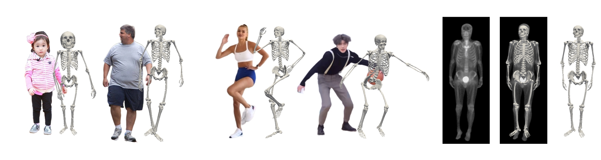
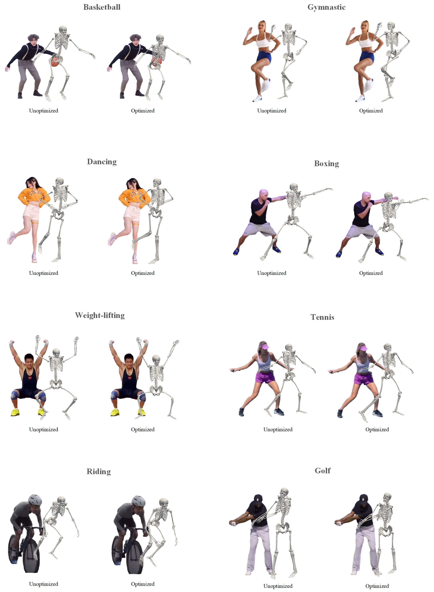
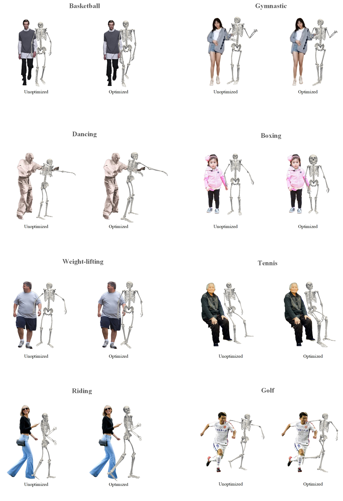

# Personalized-Anatomical-Skeleton-Estimation-System
### Author: Boyuan Cheng

## Usage
1. Place test images in the folder `test_pictures` and test videos in the folder `test_videos`.

2. Run the system with 3 steps:

(1) 2D pose estimation:

`python 2DPoseEstimation.py --cfg halpe_26/resnet/256x192_res50_lr1e-3_1x.yaml --checkpoint halpe_26/halpe26_fast_res50_256x192.pth --indir test_pictures --outdir Landmarks/` 

or 

`python 2DPoseEstimation.py --cfg halpe_26/resnet/256x192_res50_lr1e-3_1x.yaml --checkpoint halpe_26/halpe26_fast_res50_256x192.pth --video test_videos/{video_name} --outdir Landmarks/`

(2) Converting 2D pose to 3D landmark points.:

`python 3DPoseEstimation.py --vid_path test_videos/sample_video.mp4 --json_path Landmarks/alphapose-results.json --out_path Landmarks`

(3) Personalized anatomical skeleton generation

`python run.py`

Pre-trained models are available here:

[yolov3_spp_weights](https://pjreddie.com/darknet/yolo/): Put into path `detector/yolo/data/yolov3-spp.weights`

[halpe26_fast_res50_256x192](https://drive.google.com/file/d/1S-ROA28de-1zvLv-hVfPFJ5tFBYOSITb/view): Put into path `halpe_26/halpe26_fast_res50_256x192.pth`

## Introduction
This work proposed an end-to-end personalized anatomical skeleton estimation
system (PASE) based on motion capture. two problems are addressed: (1) How
to infer personalized skeletons with anatomical constraints based on human move-
ment and external features. (2) How to optimize estimated standard anatomical
skeletons into personalized skeletons. By addressing these research questions, this
work aims to estimate a human skeleton with anatomical constraints based on in-
verse kinematics and adapts the shape of each bone in the skeleton to the body
shape of the person in the given monocular image or video.
The system can be divided into three parts. In the first part, Alphapose and Mo-
tionBERT pose estimation algorithms are combined to estimate the 3D coordinates
of landmark points and a simplified human skeleton. These extracted coordinates
are then fed into an inverse kinematic model in the second part, which generates
motion information for each bone to construct a standardized skeleton with biome-
chanical constraints. In the last part, an optimization algorithm is designed for the
system to achieve accurate personalization.
Quantitative and qualitative experimental results from testing and evaluating on a
large diversity of images and videos show that the certain aspects of the system
outperform the state-of-the-art research that exists.

## Demo

